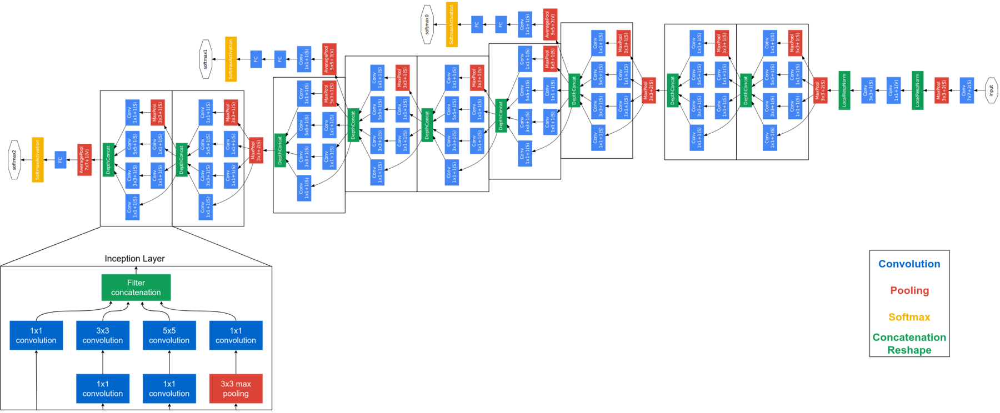

# Archtiecture 

</img>
 

### GoogLeNet - codenamed Inception - uses the idea of stacked Inception modules to build a very deep network and reducing the computational complexity required by not using any fully connected layers.

### Inception modules allows for deeper networks by using dimesionality reduction through 1x1 conv filters, and rather than stacking filters sequentially , they operate on the same level

