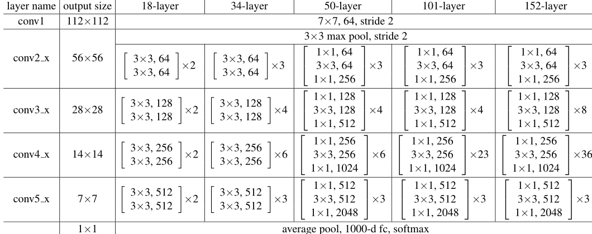

# Archtiecture 

</img>
 

### Residual Networks was a revolution in computer vision , because they solve the vanishing gradient problem in a very clever way which allows the training of very deep models

### The idea of residual connections allow "information" to skip layers without passing through non-linear activations

### This paper marked the beginning of using "bottleneck" architectures.